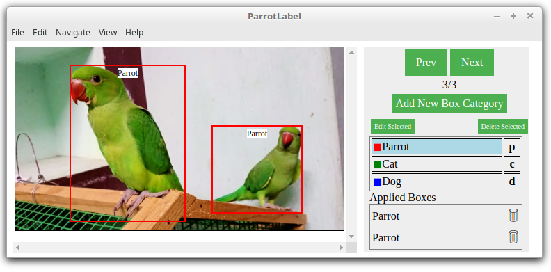
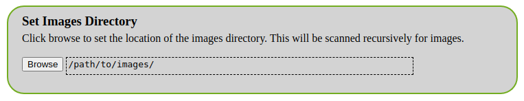
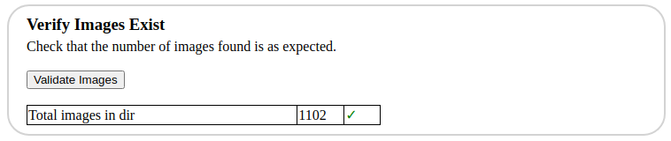
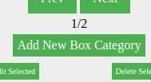
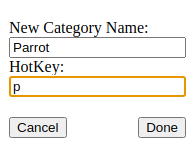
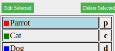
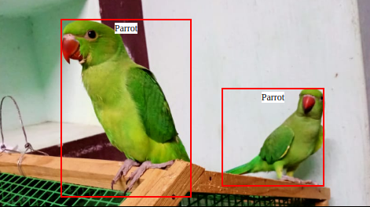
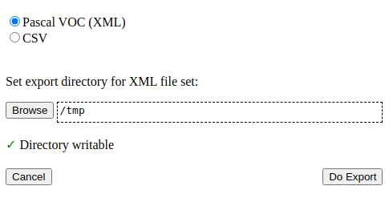

# ParrotLabel
ParrotLabel is a graphical tool for creating training data for use in image recognition machine learning applications. Images can be annotated with rectangles to mark-up and label regions of interest. The labelled images can be used as a basis for training various machine learning frameworks including the [TensorFlow Object Detection API](https://tensorflow-object-detection-api-tutorial.readthedocs.io/en/latest/training.html).

    
*Photo credit S. Nivethika*

## Features
* Annotations can be saved in JSON, CSV or XML (Pascal VOC format used by ImageNet)
* Can hande large sets of images
* Supports JPEG, PNG, WebP and GIF.
* Keyboard nudge to precisely align boxes using the arrow keys
* Image zoom using the mouse scroll wheel
* Box positions are recorded at arbitrarily high precision for any zoom level
* Convenient custom hotkeys to switch between categories

## Builds

Builds are available from the [releases](https://github.com/InexplicableMagic/parrotlabel/releases/) page for Linux as either a .deb package or a tar.gz.

On Ubuntu (and other Debian derivatives) you can often simply double click the .deb package to install. For other distros unpack the tar.gz archive and run the "parrotlabel" binary found in the top level directory.

## Quickstart Tutorial

### Starting a New Labelling Session

* Ensure "Start new session" is selected
* Click "Browse" under Set Images Directory. Choose the directory containing the images to be labelled.
* Sub-directories will also be inspected recursively for images
* It is assumed image files have a standard file extension such as .jpg, .jpeg, .gif, .png or .webp

* Under "Verify Images Exist", a count of the total number of images found will be shown
* If zero images were found, the session cannot proceed. In which case click browse again and choose another directory.

* Click "Start Labelling"

### Labelling Images

Click the "Add New Box Category" button

<kbd></kbd>

* Enter a name for the category of object that you would like to label
* Optionally enter a single character hotkey.
* When the hotkey is typed the category will be selected
* Click Done

<kbd></kbd>

* Add more box categories as required to represent further objects you would like to label
* Select a category either by clicking it on the right hand list or typing the hotkey that was set.

<kbd></kbd>

* Using the mouse draw one or more boxes anywhere over the image. The drawn boxes will be assigned the selected category.
* If the position of the drawn box is not quite perfect it can be adjusted slightly using the arrow keys which will cause the box to be nudged by one pixel
* The width and height of the drawn box can be adjusted one pixel at a time using Shift + Arrow Keys

<kbd></kdb>

* To zoom in, use Ctrl + the mouse scrollwheel. Alternatively use Ctrl + Up Arrow or Numpad 8 whilst pointing at the position on the image to be zoomed.
* When all required boxes are drawn move to the next image by either clicking "Next" or using Ctrl+the right arrow key. Numpad 6 is a further alternative,
* Previously drawn boxes can be selected by Shift+Click
* The labelled category of boxes can be modified by selecting the required new category and then clicking box while holding down the right Alt key (often labelled Alt Gr)
* Boxes can be be deleted by selecting (Shift+click) then typing either Backspace or Del

### Exporting Labelling Data

* First save the labelling state using "Save" from the "File" menu. The labeller cannot currently import the export formats, therefore always save a copy in the native format so that the session can be continued later if required.
* Choose "Export" from the "File" menu
* Choose either Pascal VOC or CSV (Comma Separated Values) format as required.

<kbd></kdb>

* When using Pascal VOC mode, it is the convention that the labelling data for each image is stored in a separate file. Therefore a directory must chosen where the set of files may be saved.
* Choose the directory using the "Browse" button and then click "Do Export". A set of XML files will then be written to the directory (one per image).
